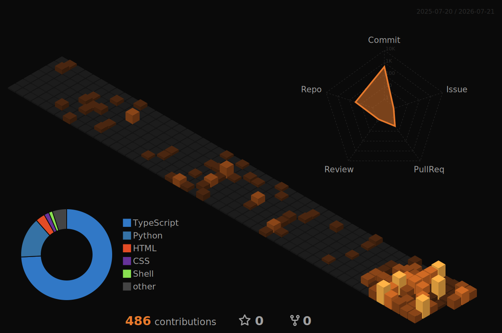

<!--
  Ahmed Raza — GitHub Profile README
  Theme: Premium dark tech • Accent: Copper-Orange #E97A2C on Black #0A0A0A
  Identity: Islamic Scholar × AI Solutions Expert
  Fonts: Orbitron (titles)
  Auto-generated assets: profile-3d-contrib/ (3D graph) + output branch (snake) via GitHub Actions
-->

<!-- SEO keywords -->
<!-- Ahmed Raza, Ahmed Raza AI, Ahmed Raza AI Solutions Expert, Islamic Scholar AI, Agentic AI, Multi-agent Systems, Next.js, Python, FastAPI, Cybrum Solutions, Team Lead Translation, Dawat-e-Islami, Pakistan AI Developer -->

<!-- 🔶 Animated Copper Wave Header -->

  

﷽

<!-- 🔶 Animated Typing Roles -->

  <picture>
    <source media="(prefers-color-scheme: dark)"
      srcset="https://readme-typing-svg.demolab.com?font=Orbitron&size=28&duration=3200&pause=800&color=E97A2C&center=true&vCenter=true&width=1000&lines=Islamic+Scholar+%C3%97+AI+Solutions+Expert;Team+Lead+Translation+%40+Dawat-e-Islami;Founder+of+Cybrum+Solutions;Agentic+AI+%E2%80%A2+Multi-agent+Systems+%E2%80%A2+RAG;Combining+Islam+with+cutting-edge+AI" />
    <source media="(prefers-color-scheme: light)"
      srcset="https://readme-typing-svg.demolab.com?font=Orbitron&size=28&duration=3200&pause=800&color=B25515&center=true&vCenter=true&width=1000&lines=Islamic+Scholar+%C3%97+AI+Solutions+Expert;Team+Lead+Translation+%40+Dawat-e-Islami;Founder+of+Cybrum+Solutions;Agentic+AI+%E2%80%A2+Multi-agent+Systems+%E2%80%A2+RAG;Combining+Islam+with+cutting-edge+AI" />
    
  </picture>

<!-- Profile Image -->

  

  <em>Bridging authentic Islamic knowledge with cutting-edge AI technology.</em>

<!-- Divider -->

  

<!-- Social Links -->

  
  
  
  
  

  

---

## ⚡ About Me

> *An active Islamic Scholar simultaneously learning and applying modern technology — combining Islam with tech to make authentic Islamic knowledge accessible, easy, and engaging for everyone.*

- 🕌 **Islamic Scholar** — Hafiz-e-Quran, 8+ years as an **Asst. Shariah Advisor** (معاون شرعی مشیر)
- 🌐 **Team Lead Translation** at **Dawat-e-Islami's** Translation Department (شعبہ تراجم) — leading a **33-language** Quranic content pipeline
- 🚀 **Founder & AI Solutions Expert** at [**Cybrum Solutions**](https://www.linkedin.com/company/cybrumsolutions) — AI automation for businesses across Pakistan
- 🤖 **Focus:** Agentic AI • Multi-agent Systems • LLM Integration • RAG • Full-Stack Development
- 🎓 **Certified:** Cloud Computing & Agentic AI (GIAIC) • Generative AI & Chatbots (SMIT)
- 🎯 **Mission:** Make Islam + AI work together — authentic knowledge, modern delivery

---

## 🧠 Tech Stack

  

  

  
  
  
  
  
  
  
  

---

## 🔥 GitHub Analytics

  

  
  

  

---

## 🧊 3D Contribution Graph

  

---

## 🐍 Contribution Snake

  

  

---

## 🚀 Featured Projects

  
  

  
  

  
  

---

## ⚙️ What I'm Building

- 🕌 **Quran Translation Management System** — a full-stack Next.js + Supabase platform driving a 33-language Quranic translation workflow
- 🤖 **Agentic AI systems** — multi-agent workflows with LangGraph, CrewAI & n8n
- 💬 **WhatsApp chatbots & CRM automation** for SMEs and Islamic publishers via Cybrum Solutions
- 🧩 **LLM + RAG integrations** that put authentic knowledge behind a modern interface
- 📝 Writing about **Islam + AI** on my [portfolio blog](https://www.irazaahmed.me/blog)

---

## 🧬 Philosophy

> **Execution Over Words.**
>
> *"Knowledge becomes powerful when it's made accessible."*

  

---

<!-- Portfolio CTA -->

  

<!-- Animated Footer -->

  <picture>
    <source media="(prefers-color-scheme: dark)"
      srcset="https://readme-typing-svg.demolab.com?font=Orbitron&size=22&duration=4000&pause=1200&color=E97A2C&center=true&vCenter=true&width=800&lines=Combining+Islam+with+cutting-edge+AI;Build.+Automate.+Empower.;Let's+create+something+meaningful+together" />
    <source media="(prefers-color-scheme: light)"
      srcset="https://readme-typing-svg.demolab.com?font=Orbitron&size=22&duration=4000&pause=1200&color=B25515&center=true&vCenter=true&width=800&lines=Combining+Islam+with+cutting-edge+AI;Build.+Automate.+Empower.;Let's+create+something+meaningful+together" />
    
  </picture>

<!-- Copper Footer Wave -->

  

